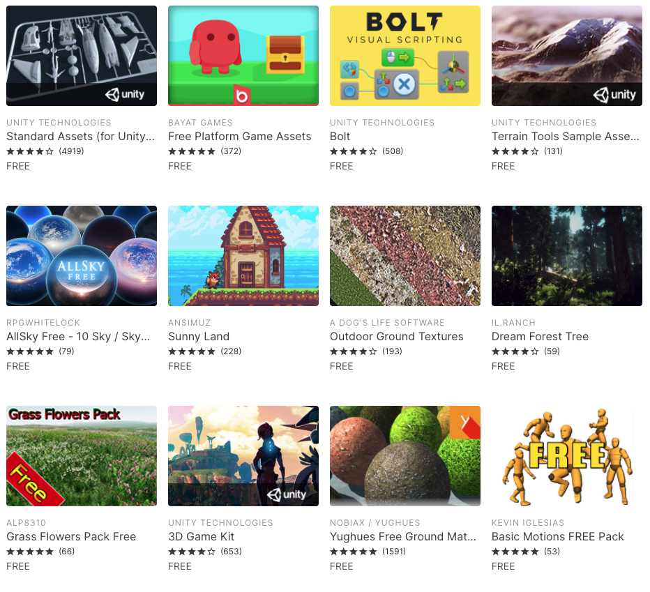
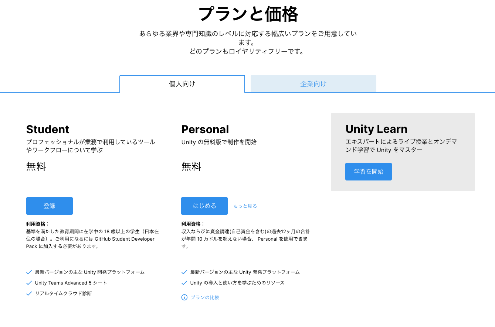
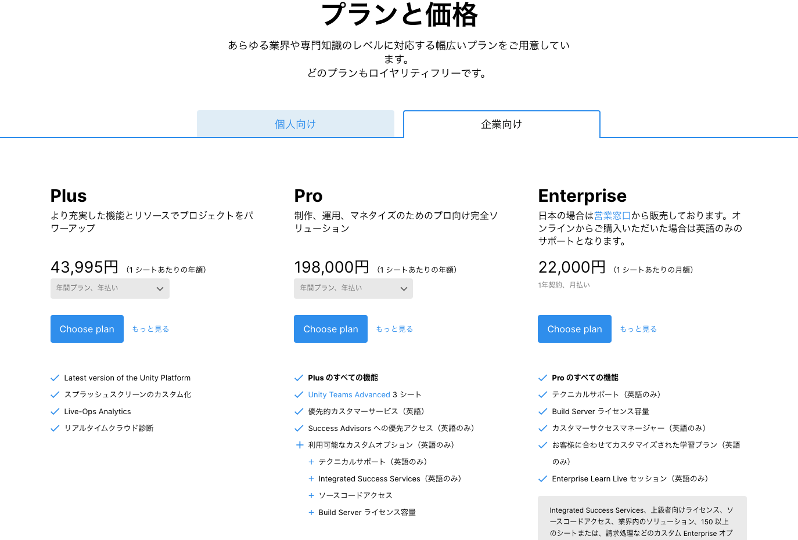
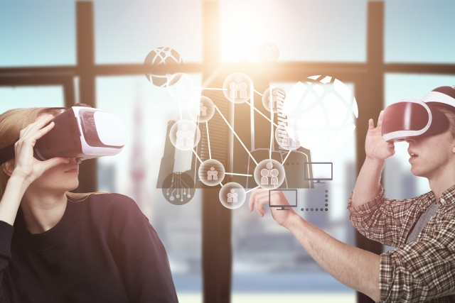

# Unity について

## Unity とは

Unity とは、ユニティ・テクノロジーズ社が提供しているゲームエンジン、またはゲーム開発プラットフォームになります。

ゲームエンジンとは、その名前の通りゲームを動かすための様々な機能を兼ね備えた開発環境を提供するソフトウェアの総称です。

Unity では 2D、3D はもちろんのこと、最近よく耳にする VR、AR といった XR のアプリケーションも手軽に開発することが可能で、開発したゲームを実行できるところまで全て Unity 内で行うことができるため、ゲームエンジンの枠を超えた総合的なゲーム開発プラットフォームとも言えます。

そのような Unity の主な特徴をいくつか紹介します。

# Unity の主な特徴

## ① マルチプラットフォームに対応している

Unity で開発したゲームは、Windows や Mac といったパソコン用のソフト、iOS、Android などのスマートフォン向けのアプリケーションにも書き出すことができます。
そのほかにも、PlayStation、Xbox、Switch などといった家庭用ゲーム機にもリリースすることができ、Oculus Quest などの VR 機器へのリリースも可能です。

 
 

## ② 充実のアセットストア

アセットストアとは Unity で使用できる 3D オブジェクトや効果音などを売買できるオンラインストアのことです。

ここでは 3D モデル、テクスチャ、マテリアル、パーティクルシステム、効果音といったゲーム開発で必要な素材ほぼ全てを購入することができ、さらにはチュートリアル、完成されたプロジェクトや汎用性の高いスクリプトなども購入できます。

さらにこのアセットストアには無料のアセットも大量に存在してます。
2020 年の 9 月時点で無料で使うことのできるアセットは 6,000 点以上あるので、基本的なゲームは全て無料のアセット、素材だけで作ることができます。

 
 

## ③ 無料で使用することができる

Unity にはいくつかプランがあるのですが、過去 12 ヶ月以内に収益、または資金が 10 万ドル未満の個人の場合は無料で Unity を使用することができます。

収益や企業規模によって Plus、Pro、Enterprise 版など様々なプランがありますが、個人で Unity を始めるといった場合は、基本的に無料版を選択しましょう。
各プランの詳細等はこちらの公式ページをご確認ください。

その他にも、少ないコード量で 3D オブジェクトを動かせたり多度、様々な特徴があり多くの開発者が好んでこの Unity というゲームエンジンを使用しています。

---

# Unity でできること

Unity はゲームエンジンという説明をしましたが、用途はゲーム開発以外にも様々なものがあります。

特に VR の技術を利用したコンテンツ、例えば医療の分野などでは、人間の骨格などを 3D で描画し、研修などに用いられていたり、外出できない患者さんに対して VR で擬似外出を体験してもらい心のケアという目的などにも使われています。

また、不動産業界などでは 3D で部屋の間取りを再現し、入居者の方に現地に行かなくてもその部屋の雰囲気を体験してもらうといったサービスも最近出始めてきました。

このように、近年ではゲーム業界以外でも多くの Unity コンテンツの需要が増えています。もちろん、ゲーム業界でも今後益々 Unity を扱えるエンジニアの需要は高まってくると思われるので、ぜひこの機会に Unity を学んでみましょう。
