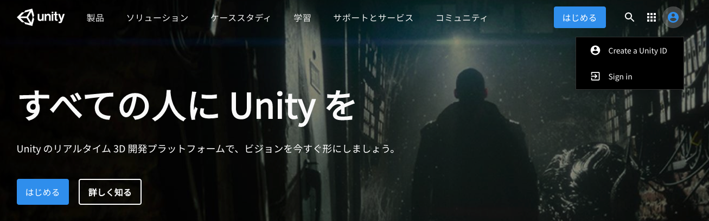
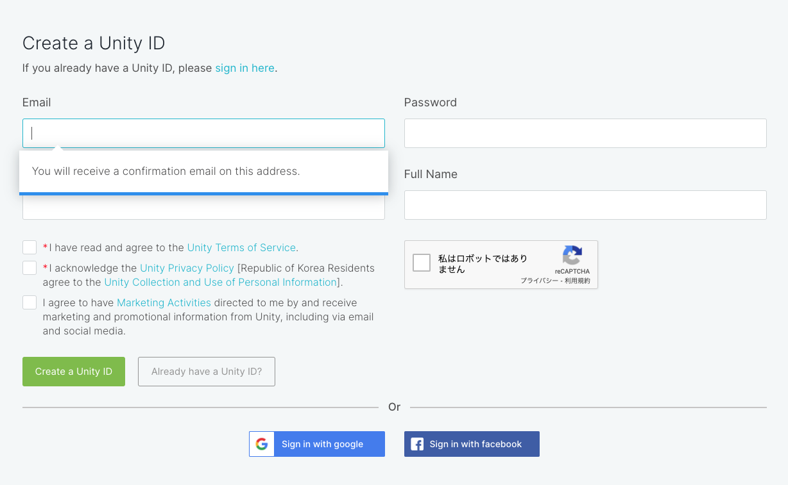
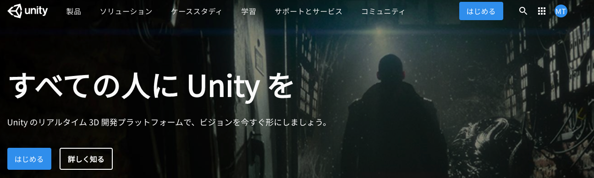
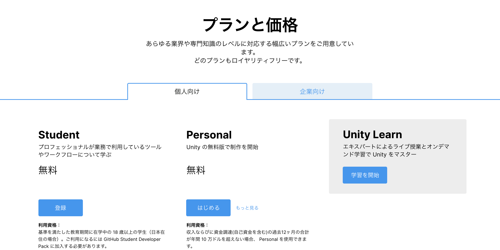
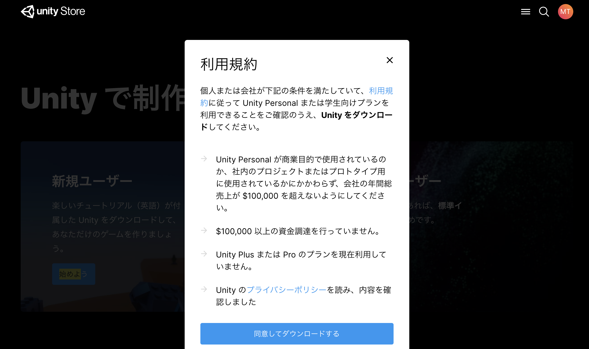

# Unityの環境構築

---

## Unityのアカウント作成

では早速Unityのアカウントの作成を行っていきたいと思います。

まずはUnityの[ホームページ](https://unity.com/ja) へアクセスしてください。

そうすると画面右上の方にユーザーアイコンがあると思うのでそこをクリックして、「Create a Unity ID」を選択します。

 
 

そうすると、画面のようなページが開くので、メールアドレス、パスワード、ユーザーネーム、フルネームを記述してください。そしてチェックボックス全てにチェックを入れ「Create a Unity ID」を選択します。

そうすると、登録したメールアドレス宛にUnityから確認のメールが届き、そこに記載されているリンクを開くと登録完了です。

もしくはGoogleアカウント、Facebookアカウントでもログインすることが可能です。任意の方法を選びましょう。

 

そしてブラウザでUnityのログイン画面が表示されれば無事アカウントの作成は完了です。
先ほど登録したメールアドレスとパスワードを入力してログインしましょう。
Google、Facebookアカウントでログインする場合は右のボタンからログインしてください。

 
 

## UnityHubのインストール

Unityアカウントの作成が終わったら、インストール作業を行います。

 

Unityの公式ページの右上にある「はじめる」ボタンをクリックします。

 

そうするとプランの選択画面になるので、個人で利用する場合は個人向けタブから任意のプランを選択してください。学生以外の方は基本的に「Personal」プランを選択することになると思います。ただしこちらは「収入ならびに資金調達（自己資金含む）の合計が年間10万ドル以下の場合のみ」利用することができます。

その他利用資格についてはプランの欄をご確認ください。

 

こちらの画面では新規ユーザー向けとリピートユーザー向けのインストーラーが表示されています。
新規ではじめる場合は新規ユーザーを選択するのは普通なのですが、こちらは公式のチュートリアルがついてくるだけで、それ以外は何も変わりません。

こちらの公式チュートリアルはとても分かりやすく作られているのですが、全て英語表記になっていたり、完成されたプロジェクト（サンプルゲーム）が一緒にダウンロードされるので少し時間がかかってしまいます。

こちらのチュートリアルはあとでもダウンロードできるので、今回は__リピートユーザー__の方からインストールを行いましょう。

 

利用規約についての画面が表示されるので、同意の部分にチェックを入れて「Download Unity Hub」と書かれたボタンをクリックしましょう。

こちらのUnityHubというものは、Unityのバージョンを管理してくれるデスクトップアプリケーションです。簡単にUnityのバージョンの変更やプロジェクト作成の一括管理ができます。

Unityは頻繁にアップデートを繰り返しており、短い頻度で新しいバージョンのUnityがリリースされています。2019年には60回以上もバージョンの更新があったのですが、アプリケーションの制作途中にUnityをアップデートすると予期せぬエラーで突然動かなくなるということもよく起こってしまいます。

そうならない為に、__一度アプリケーションを作り始めたらそのアプリケーションは完成するまで同じバージョンのUnityで作り切るようにしましょう。__
しかし、チーム開発やUnityの新しい機能を使いたいとなった場合はUnityのバージョンをアップデートしなければならない状況も生まれてくることがあります。

そのような場合にUnityHubを利用していると、現在のバージョンのUnityを保持しておきながら新しいバージョンのUnityも同時にインストールして使用することができます。

このようにUnityHubにはプロジェクトごと、チームや機能に合わせてUnityのバージョンを切り替えられるというメリットがあるので、ぜひこのUnityHubを有効的に利用してみましょう。

 

ダウンロードが終わったら、表示に従いセットアップを進めてください。
無事UnityHubが起動されたら成功です。

